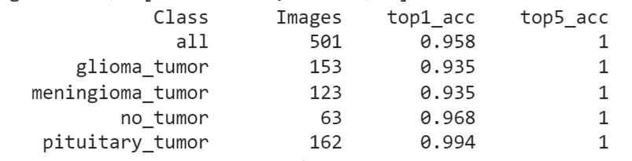
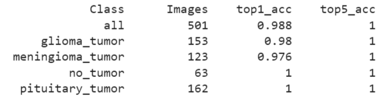
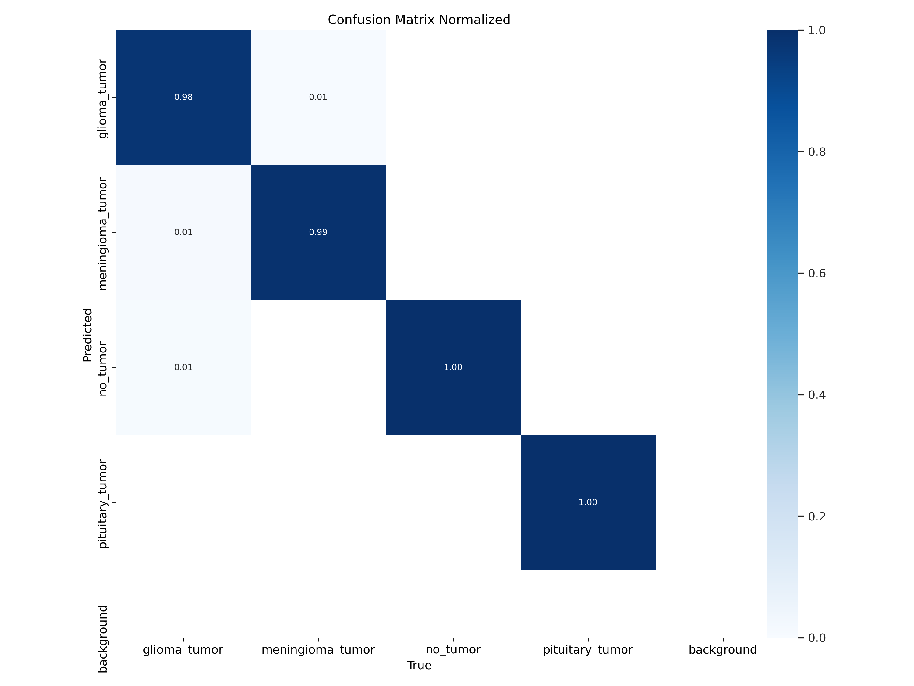
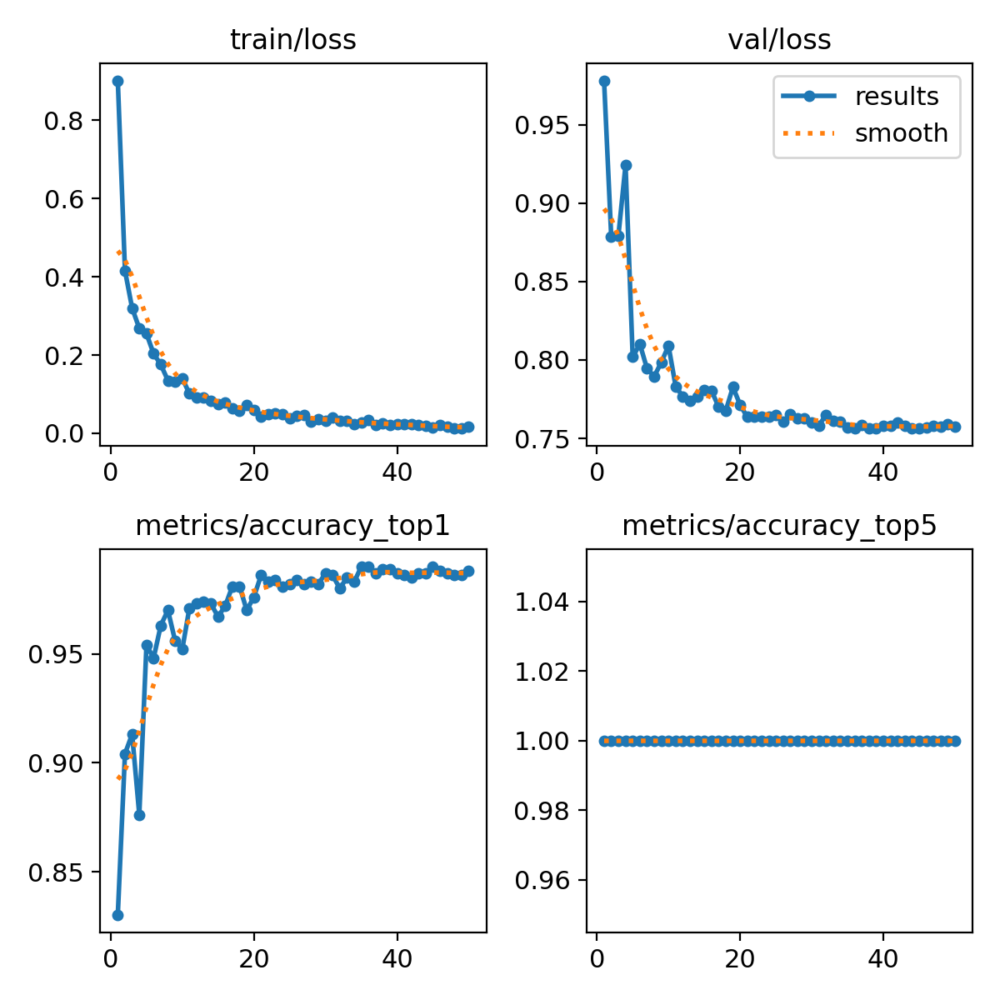

# Brain_Tumor_Classification
This repositry stores my code and results obtained by training various classification models on the Brain Tumor Dataset.  
  
The dataset comprises of four classes:  
1] glioma_tumor  
2] meningioma_tumor  
3] no_tumor  
4] pituitary_tumor  

The Classification Models used are:  
1] YOLOv5  
2] YOLOv8  
3] EfficientNet  
4] Roboflow 2.0 Multi-label Classification  
 
## Model Performance

### YOLOv5  
Epochs: 100  
Accuracy:  
  
### EffcientNet
Epochs: 50  
Version: efficientnet_b3  
Accuracy:  
  
### YOLOv8  
Epochs: 50  
Accuracy:99%    
Confusion Matrix:  

Plots:  
  
### Roboflow
Accuracy:99.1%

